# 🚀 HTML & CSS Challenges — Scrimba

  
  
  
  

  
  

  A curated collection of my solutions to the
  <a href="https://scrimba.com/css-challenges-c02p">Scrimba CSS Challenges</a>,
  focused on mastering layouts, responsiveness, and modern UI techniques.

<h2> ✨What This Repo Offers </h2>

- ✅ Fully completed CSS challenges
- 🧠 Independent problem-solving with optimized refinements
- 🎯 Practical focus on real-world CSS patterns
- 👀 Visual previews for every challenge

  

<h2>🧪 How to Get the Most Value</h2>

1. Attempt each challenge on your own.
2. Review the instructor’s explanation if needed.
3. Rebuild the solution yourself from scratch.
4. Compare approaches and optimize your code.

> **Tip:** Learning happens when you struggle a bit — don’t skip straight to the solution 😉

  

## 📸 Challenge Results

Below are previews showcasing the final results of each challenge:
<table align="center">
  <tr>
    <td><a href="https://atef7534.github.io/Scrimba-challenges/adjustable-progress-bar/index.html">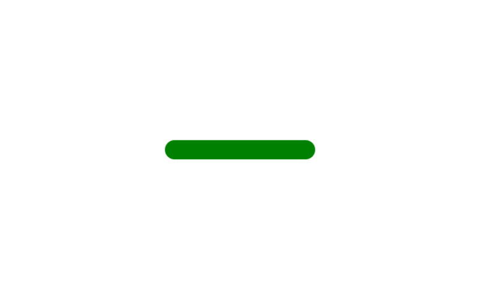</a></td>
    <td><a href="https://atef7534.github.io/Scrimba-challenges/animated-progress-bar/index.html">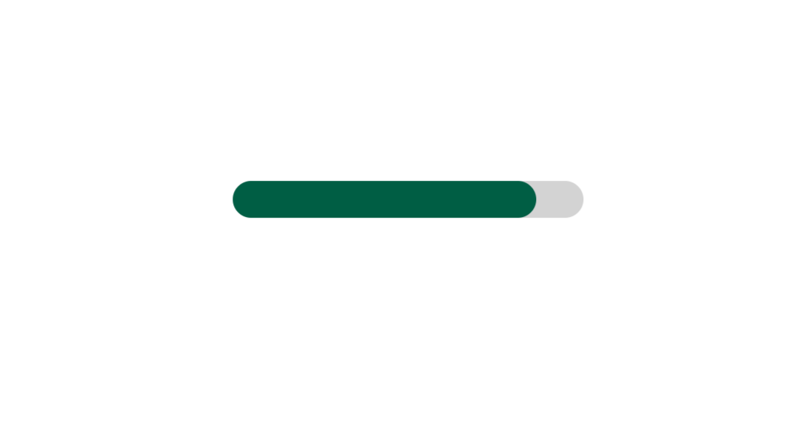</a></td>
    <td><a href="https://atef7534.github.io/Scrimba-challenges/archery-target/index.html">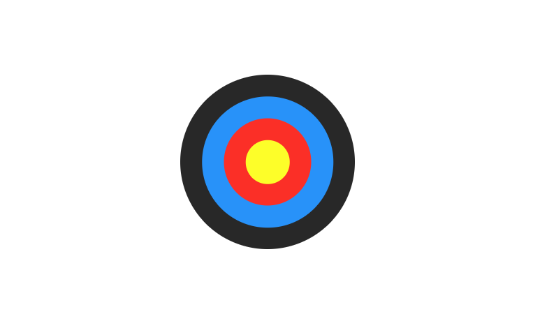</a></td>
    <td><a href="https://atef7534.github.io/Scrimba-challenges/codepen-tile/index.html">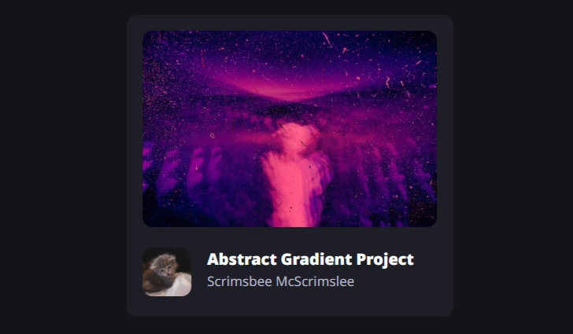</a></td>
    <td><a href="https://atef7534.github.io/Scrimba-challenges/colorful-button/index.html">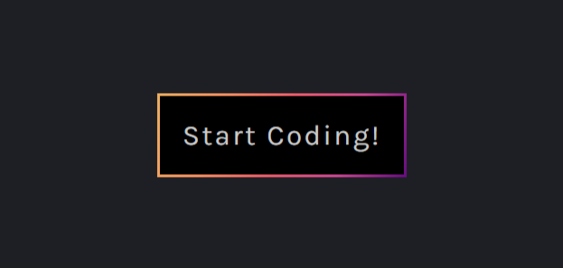</a></td>
  </tr>
  <tr>
    <td><a href="https://atef7534.github.io/Scrimba-challenges/expanding-search-bar/index.html">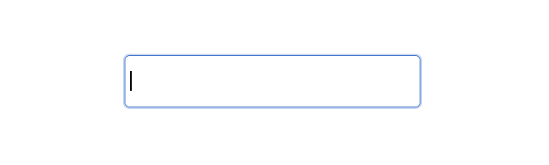</a></td>
    <td></td>
    <td></td>
    <td></td>
    <td></td>
  </tr>
  <tr>
    <td></td>
    <td><a href="https://atef7534.github.io/Scrimba-challenges/flag-of-sweden/index.html">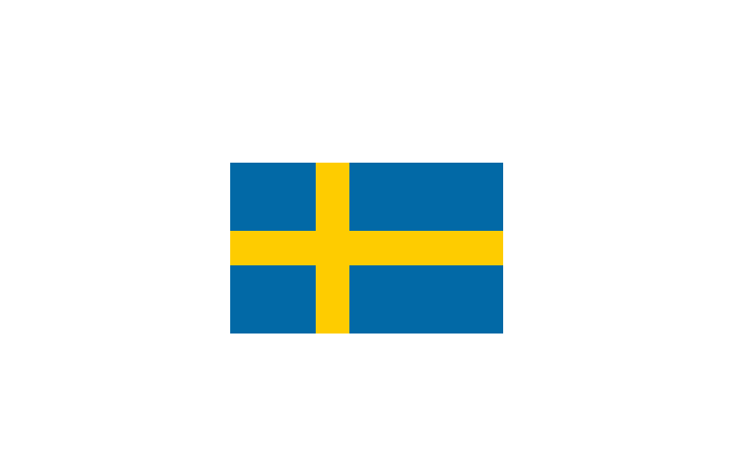</a></td>
    <td></td>
    <td><a href="https://atef7534.github.io/Scrimba-challenges/github-contributions-graph/index.html">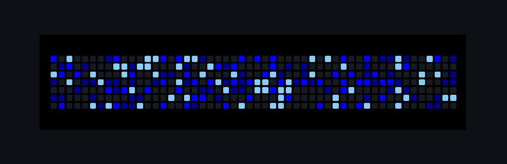</a></td>
    <td></td>
  </tr>
  <tr>
    <td><a href="https://atef7534.github.io/Scrimba-challenges/instagram-stories-menu/index.html">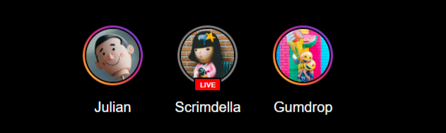</a></td>
    <td></td>
    <td></td>
    <td><a href="https://atef7534.github.io/Scrimba-challenges/loading-animation-2/index.html">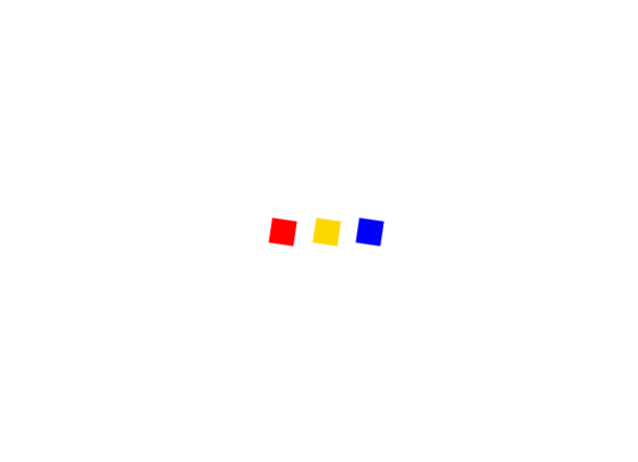</a></td>
    <td></td>
  </tr>
  <tr>
    <td><a href="https://atef7534.github.io/Scrimba-challenges/playing-card-ace-of-spades/index.html">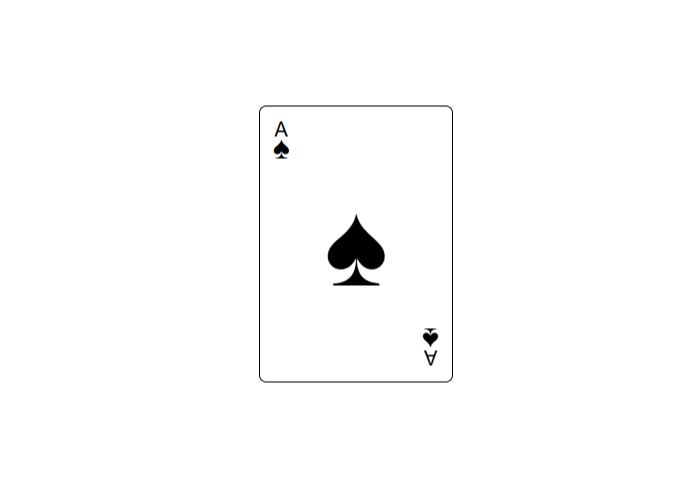</a></td>
    <td><a href="https://atef7534.github.io/Scrimba-challenges/playing-card-four-of-hearts/index.html">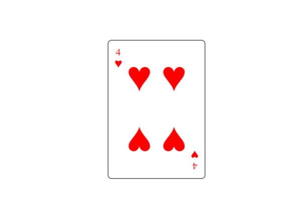</a></td>
    <td><a href="https://atef7534.github.io/Scrimba-challenges/spoiler-revealer/index.html">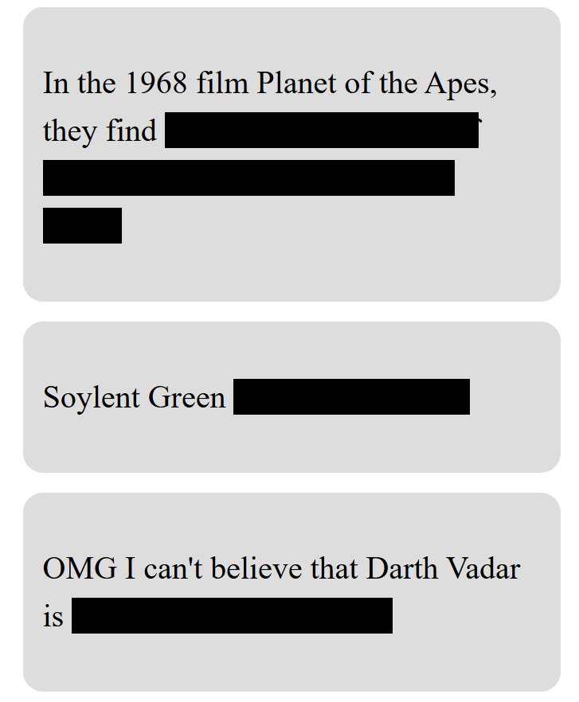</a></td>
    <td><a href="https://atef7534.github.io/Scrimba-challenges/toggle-switch/index.html">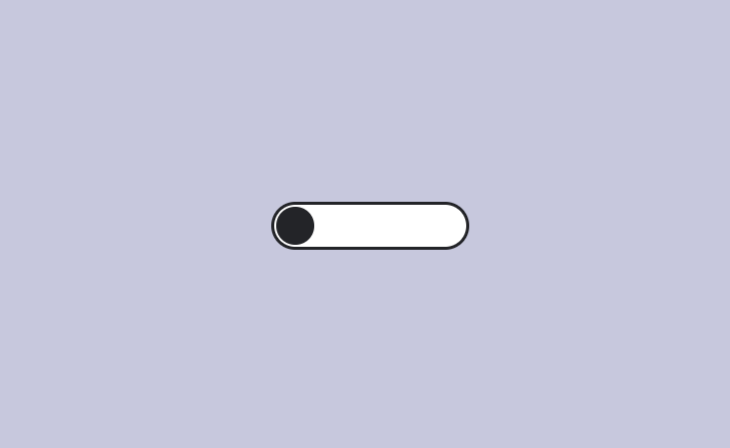</a></td>
    <td><a href="https://atef7534.github.io/Scrimba-challenges/word-carousel/index.html">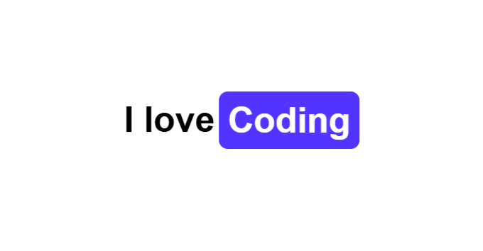</a></td>
  </tr>
</table>
